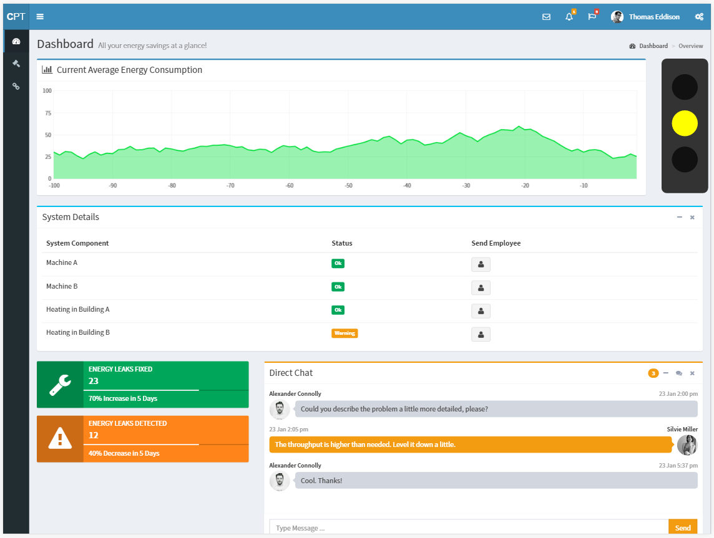
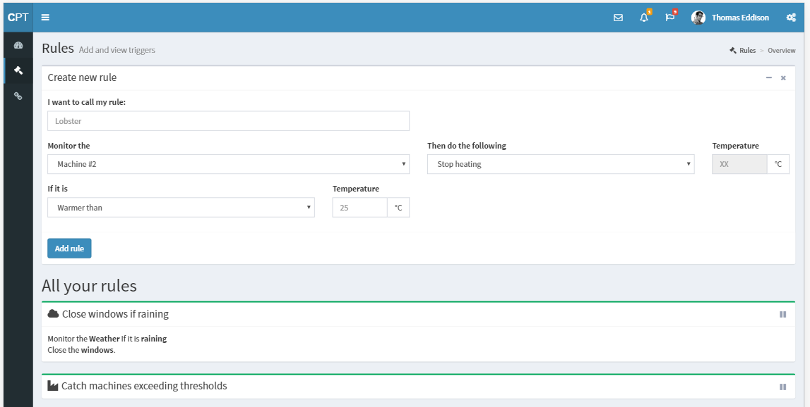

#CommunicationPlatform
During [#eehack2017](https://www.eehack.com/) we, that is [@MariusDanner](https://github.com/MariusDanner), [@emanuel-metzenthin](https://github.com/emanuel-metzenthin), [@Matzee](https://github.com/Matzee) & [@FWirtz](https://github.com/FWirtz), tackled [challenge number 3](https://www.eehack.com/challenges/) by Veolia.  
Our result "ComPlat" is a platform that visualizes factory data and simplifies making that data actionable to workers to save more energy in the long run.  
We were granted with the "VEOLIA & ÖKOTEC-CHALLENGE Award for submitting the most convincing innovative solution for the challenge 'Making enrgy consumption data actionable for industrial managers' by Veolia, Ökotec and DENEFF during the Berlin EnerygyEfficiencyHack 2017".  
About 100 engineers, coders, designers, psychologists and entrepreneurs participated.
## Screenshots
Landing page of the dashboard

Rules to automatically deal with certain events

